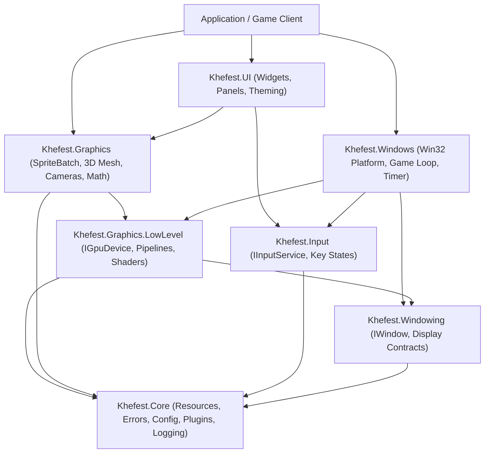

# Khefest Architecture Overview

Khefest is structured from the ground up as a modular, layered game engine and graphics framework. Its design guarantees that high-level abstractions remain cleanly decoupled from low-level operating system and hardware interop.

---

## 🏛️ Two-Tier Graphics Architecture

A defining principle of Khefest is that **the engine owns its graphics abstraction**:

```text
                    Khefest
                       │
          ┌────────────┴────────────┐
          │                         │
       High-level               Low-level
          API                       API
          │                         │
    ┌─────┴─────┐          ┌────────┴────────┐
    │            │          │                 │
   2D           3D       GPU resources    Commands
    │            │          │                 │
 SpriteBatch  MeshRenderer │                 │
 Camera2D     Perspective   └────────┬────────┘
                Camera               │
                                     v
                        Direct3D 11 Windows Backend
                        (internal implementation)
                                     │
                                     v
                                Physical GPU
```

> [!IMPORTANT]
> **Abstraction Ownership vs. Implementation Detail**
> * **The Abstraction**: The core graphics contracts (`IGpuDevice`, `IGpuBuffer`, `IGpuTexture`, `IPipeline`, `ICommandRecorder`, `ISwapChain`) are 100% Khefest-owned and platform-agnostic.
> * **The Backend**: Direct3D 11 is strictly an **internal Windows driver implementation** located in `src/Khefest.Graphics.LowLevel/Windows/`. No Direct3D types, COM pointers, or DirectX enums leak into either the high-level or low-level public API.
> * **Swappability**: Alternative backends (e.g. Vulkan, Metal, or Direct3D 12) can be plugged under `IGpuDevice` in the future without changing any game, graphics, or UI code.

---

## 🏗️ Layered Subsystem Hierarchy

The dependency flow between modules follows a strict top-down structure:



---

## 📦 Subsystem Responsibilities

### 1. `Khefest.Core`
* **Target Framework**: `net10.0` (Cross-platform capable core)
* **Responsibilities**:
  * **Result & Error System**: Strongly typed `KhefestResult<T>` and `KhefestException` with subsystem error codes (`KhefestErrorCode`).
  * **Logging Architecture**: Structured logging with `LogManager`, `ILogger`, log levels (`Trace` to `Critical`), and sink interfaces (`ILogSink`, `ConsoleLogSink`).
  * **Configuration**: Immutable records (`KhefestConfig`, `WindowConfig`, `GraphicsConfig`) and a fluent `KhefestConfigBuilder`.
  * **Resource Lifecycle**: Centralized `ResourceManager`, `ResourceLifetimeTracker`, reference-counted `SharedResource<T>`, and `ResourceCache<T>`.
  * **Plugins**: Dynamic module loading using collectible `AssemblyLoadContext` (`PluginLoadContext`), `PluginManager`, and `IExtensionRegistry`.
  * **CPU Profiling**: Microsecond-resolution hierarchical profiling with `Profiler.BeginScope()`.

### 2. `Khefest.Windowing`
* **Target Framework**: `net10.0`
* **Responsibilities**:
  * Platform-agnostic interfaces defining display contracts: `IWindow`, `IDisplayMonitor`.
  * Window lifecycle events: `Created`, `Closed`, `Resized`, `FocusChanged`.
  * Display mode declarations: `WindowMode` (Windowed, BorderlessFullscreen, ExclusiveFullscreen).

### 3. `Khefest.Input`
* **Target Framework**: `net10.0`
* **Responsibilities**:
  * Unified input abstraction: `IInputService`.
  * Keyboard state management: `IsKeyDown`, `IsKeyPressed`, `IsKeyReleased`.
  * Character input event dispatching: `CharTyped` (captures unicode text entry).
  * Mouse state management: `MousePosition`, button states (`Left`, `Right`, `Middle`), and scroll wheel delta tracking.

### 4. `Khefest.Graphics.LowLevel`
* **Target Framework**: `net10.0-windows`
* **Responsibilities**:
  * **Bespoke Hardware Abstraction**: Exposes `IGpuDevice`, `IGpuBuffer`, `IGpuTexture`, `IPipeline`, `ICommandRecorder`, and `ISwapChain`.
  * **Native Direct3D 11 Backend**: Implements low-level GPU communication using lightweight P/Invoke without external third-party wrapper dependencies (SharpDX, Silk.NET, Vortice).
  * Encapsulates shader reflection, input layout bindings, rasterizer states, blend states, and render passes.
  * For full architectural details on the GPU path selection, see [ADR-001: Windows GPU Path and Renderer Architecture](architecture/ADR-001-Windows-GPU-Path-and-Renderer-Architecture.md).

### 5. `Khefest.Graphics`
* **Target Framework**: `net10.0-windows`
* **Responsibilities**:
  * **High-Level 2D**: `SpriteBatch` batching engine, `Camera2D`, vector shape rendering (`ShapeRenderer2D`), and textured `BitmapFont`.
  * **High-Level 3D**: `MeshRenderer`, `MeshPrimitives` (Cube, Sphere, Quad), `PerspectiveCamera`, `Material`, and Blinn-Phong lighting (`DirectionalLight`, `AmbientLight`).
  * **Spatial Mathematics**: `BoundingBox` (AABB), `BoundingSphere`, `BoundingFrustum`, `Plane`, and `MathHelper` in `Khefest.Graphics.Mathematics`.
  * **Diagnostics**: `DebugOverlay`, `RenderStatistics`, `FrameStatistics`, and debug-time `GpuValidator`.
  * **Memory Pools**: Transient GPU buffer pool (`GpuBufferPool`) and texture target pool (`RenderTargetPool`).

### 6. `Khefest.Windows`
* **Target Framework**: `net10.0-windows`
* **Responsibilities**:
  * Concrete Win32 implementation of `IWindow` (`Win32Window`).
  * Native message pump (`PeekMessageW`, `TranslateMessage`, `DispatchMessageW`).
  * Virtual-key translation via `Win32KeyMapper`.
  * High-precision timing via `Win32Timer` driving `GameTime`.
  * Native display enumeration (`EnumDisplayMonitors`, `GetMonitorInfoW`).
  * Master application lifecycle host: `KhefestApp.Run()` and base `Game` class.

### 7. `Khefest.UI`
* **Target Framework**: `net10.0-windows`
* **Responsibilities**:
  * Retained visual element tree (`Widget`, `Panel`).
  * Two-pass layout engine (`Measure` / `Arrange`).
  * Layout containers: `Canvas` (absolute layout) and `StackPanel` (linear layout).
  * Interactive widgets: `Button`, `Label`, `TextBox`, `Slider`, `ProgressBar`, `CheckBox`.
  * Keyboard navigation and focus tracking (`FocusedWidget`).
  * Built-in `UITheme` theming engine.

---

## 🧵 Concurrency & Execution Model

1. **Main Thread Exclusivity**:
   * The Win32 window message pump and GPU rendering execute on the primary thread (STA).
   * Native window procedures receive Windows messages synchronously via `DispatchMessageW`.
2. **Deterministic Frame Loop**:
   * **Input Poll**: Processes Windows input messages and latches key/mouse transitions.
   * **Update**: Fixed or variable time step updates your game simulation and UI state.
   * **Render**: Records GPU commands and submits them to the graphics queue.
   * **Present**: Swaps the back buffer (`ISwapChain.Present()`).
3. **Thread-Safe Utilities**:
   * `ResourceCache<T>` and `LogManager` are built to be safe for concurrent access across worker tasks.
