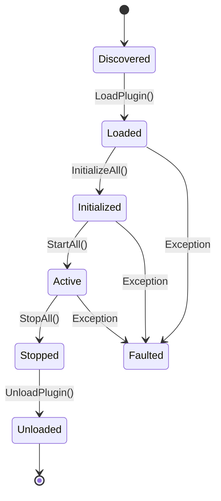

# Plugins & Extension System Guide

Khefest provides a modular, dynamic plugin architecture in [`Khefest.Core.Plugins`](../src/Khefest.Core/Plugins). The system allows developers to build pluggable modules, editor extensions, custom asset loaders, and game mods that can be loaded, ordered by dependency, executed, and dynamically unloaded at runtime.

---

## 🧩 Core Architecture

The plugin system consists of four primary components:

1. **`IKhefestPlugin`**: The contract implemented by every plugin module.
2. **`IPluginContext`**: Gives the plugin access to the host's logger, configuration, and extension registry.
3. **`IExtensionRegistry`**: A strongly typed service locator enabling plugins to register and consume extension points.
4. **`PluginManager`**: The orchestration engine responsible for discovery, dependency sorting, lifecycle progression, and collectible load context management.

---

## 🔄 Plugin Lifecycle

A plugin transitions through a defined state machine:



* **Discovered**: Plugin metadata identified.
* **Loaded**: Assembly loaded into an isolated `PluginLoadContext`.
* **Initialized**: `IKhefestPlugin.Initialize(IPluginContext)` invoked. Extension points registered.
* **Active**: `IKhefestPlugin.Start()` invoked. Plugin background tasks or listeners active.
* **Stopped**: `IKhefestPlugin.Stop()` invoked. Operations gracefully suspended.
* **Unloaded**: Assembly load context unloaded and collectible by the .NET garbage collector.

---

## 💻 Writing a Plugin

### 1. Define the Plugin Implementation
```csharp
using Khefest.Core.Plugins;

public sealed class AudioPlugin : IKhefestPlugin
{
    public PluginMetadata Metadata => new(
        Id: "com.example.audio",
        Name: "Audio Subsystem Plugin",
        Version: new Version(1, 0, 0),
        Author: "Khefest Community",
        Dependencies: new[] { "com.example.core-services" }
    );

    private IPluginContext? _context;

    public void Initialize(IPluginContext context)
    {
        _context = context;
        context.Logger.Info("Initializing Audio Plugin...");

        // Register custom extension implementation
        context.Extensions.Register<IAudioService>(new MyCustomAudioService());
    }

    public void Start()
    {
        _context?.Logger.Info("Audio Plugin Started.");
    }

    public void Stop()
    {
        _context?.Logger.Info("Audio Plugin Stopped.");
    }

    public void Dispose()
    {
        // Cleanup native or managed resources
    }
}
```

---

## 🔗 Extension Points (`IExtensionRegistry`)

The extension registry allows decoupled communication between the host engine and disparate plugins without direct assembly references:

```csharp
// 1. Defining an extension point
public interface IAssetImporter
{
    bool CanImport(string extension);
    object Import(string path);
}

// 2. Registering an extension (inside a plugin)
context.Extensions.Register<IAssetImporter>(new PngImporter());

// 3. Consuming extensions (inside the engine or another plugin)
if (context.Extensions.TryGet<IAssetImporter>(out var importer))
{
    var asset = importer.Import("player.png");
}

// 4. Multiple extensions for the same contract
var allImporters = context.Extensions.GetAll<IAssetImporter>();
```

---

## 🗃️ Dependency Sorting & Cycle Detection

The `PluginManager` uses a **Directed Acyclic Graph (DAG)** topological sort to guarantee that dependencies are initialized before dependents:

* If Plugin B depends on Plugin A, `PluginManager.StartAll()` will always start Plugin A first.
* When shutting down, `PluginManager.StopAll()` stops plugins in reverse topological order (Plugin B first, then Plugin A).
* If a circular dependency is detected (e.g., A -> B -> A), `PluginManager` throws a descriptive `KhefestException` with `KhefestErrorCode.PluginLoadFailed`.

---

## 🧹 Memory Isolation & Dynamic Unloading

Every plugin is loaded into its own collectible [`PluginLoadContext`](../src/Khefest.Core/Plugins/PluginLoadContext.cs), an isolated derivative of .NET's `AssemblyLoadContext`:

```csharp
var pluginManager = new PluginManager(logger, config);

// Load plugin dynamically from file path
var plugin = pluginManager.LoadPlugin("plugins/AudioPlugin.dll");

pluginManager.InitializeAll();
pluginManager.StartAll();

// ... runtime execution ...

// Unload plugin cleanly
pluginManager.StopAll();
pluginManager.UnloadPlugin(plugin.Metadata.Id);

// The collectible AssemblyLoadContext is released to the .NET Garbage Collector
```
