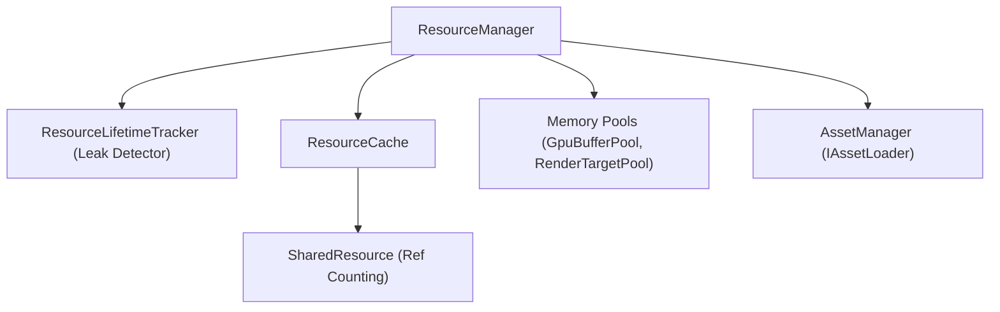

# Resource Management & Diagnostics Guide

Robust memory safety, zero-leak guarantees, and rich performance diagnostics are fundamental pillars of the Khefest architecture.

---

## 🧠 Part 1: Resource Management Architecture

Khefest enforces explicit tracking for all native and managed engine resources (GPU buffers, textures, shaders, sound banks, and meshes).



### 1. `SharedResource<T>` (Reference Counting)
Wraps expensive or shared GPU assets and provides deterministic reference counting:
```csharp
var texture = GpuDevice.CreateTexture(...);
var sharedTex = new SharedResource<IGpuTexture>(texture);

// Pass ownership / retain reference
sharedTex.Retain(); // Ref count = 2

// Consumer finishes
sharedTex.Release(); // Ref count = 1

// Final release frees underlying GPU resource
sharedTex.Release(); // Ref count = 0 -> texture.Dispose()
```

### 2. `ResourceCache<T>` (Thread-Safe Asset Cache)
Maintains reusable instances by string key:
```csharp
var cache = new ResourceCache<Texture2D>();

// Automatically fetches existing or creates a new entry
var texture = cache.GetOrCreate("textures/grass.png", key => LoadTextureFromDisk(key));

// Invalidate specific resource or clear all
cache.Remove("textures/grass.png");
cache.Clear();
```

### 3. Reusable Memory Pools
Avoids allocating and destroying GPU resources every frame:

* **`GpuBufferPool`**: Rent and return transient vertex/index/constant buffers.
* **`RenderTargetPool`**: Rent temporary off-screen render targets for post-processing passes.

```csharp
// Rent a transient constant buffer
var buffer = gpuBufferPool.Rent(sizeInBytes: 256, BufferUsage.Constant);

// Update and use in render pass
buffer.SetData(matrixData);
recorder.SetConstantBuffer(0, ShaderStage.Vertex, buffer);

// Return to pool for reuse in subsequent frames
gpuBufferPool.Return(buffer);
```

### 4. Zero-Leak Verification & Diagnostics
The [`ResourceLifetimeTracker`](../src/Khefest.Core/Resources/ResourceLifetimeTracker.cs) records an allocation stack trace whenever a resource is created.

Upon application exit, `KhefestApp` automatically validates that all allocated resources have been disposed:
```csharp
if (resources.Tracker.HasLeaks)
{
    string report = resources.Tracker.GenerateLeakReport();
    logger.Error(report);
}
```
If a leak occurs, the report pinpoints the exact line of code and call stack where the leaked resource was originally allocated.

---

## 🔍 Part 2: Debugging & Diagnostics

### 1. CPU Profiler (`Profiler`)
Instruments code blocks with sub-microsecond precision:
```csharp
public override void Update(GameTime gameTime)
{
    using (Profiler.BeginScope("PhysicsSimulation"))
    {
        _physicsEngine.Step(gameTime.DeltaTimeSeconds);
    }

    using (Profiler.BeginScope("AIStep"))
    {
        _aiManager.Update();
    }
}
```
Retrieve samples at runtime via `Profiler.GetSamples()` or `Profiler.FindSample("PhysicsSimulation")`.

---

### 2. Telemetry Statistics

* **`FrameStatistics`**: Tracks real-time FPS, delta time in seconds, and moving averages.
* **`RenderStatistics`**: Tracks GPU workload per frame:
  * `DrawCalls`: Number of distinct draw/indexed draw commands executed.
  * `VertexCount`: Total vertices processed.
  * `BatchFlushes`: Number of geometry batches submitted by `SpriteBatch`.
  * `PipelineBinds`: Pipeline state object changes.

```csharp
// Access statistics inside your game loop
float currentFps = gameTime.FramesPerSecond;
int drawCalls = RenderStatistics.Current.DrawCalls;
```

---

### 3. Debug-Time GPU Validator (`GpuValidator`)
Catches graphics programming errors before they reach the driver:

* Verifies that a pipeline is bound before drawing.
* Ensures vertex and index buffers are bound for indexed draws.
* Detects unclosed render passes.
* Verifies viewport boundaries are non-zero.

Validation mode can be configured in your `GraphicsConfig`:
* `ValidationMode.Disabled`: Zero runtime overhead.
* `ValidationMode.LogWarning`: Logs diagnostics to `LogManager`.
* `ValidationMode.ThrowException`: Throws immediate `KhefestException` with `KhefestErrorCode.GpuValidationError`.

---

### 4. On-Screen Debug Overlay (`DebugOverlay`)
Renders live telemetry cards in your viewport:
```csharp
_debugOverlay = new DebugOverlay();

// In Render():
_debugOverlay.Draw(_spriteBatch, gameTime, RenderStatistics.Current);
```
Displays:
* Live FPS and frame latency (ms).
* Draw call count and vertex count.
* Active memory pool utilization.
* Custom user telemetry cards.
